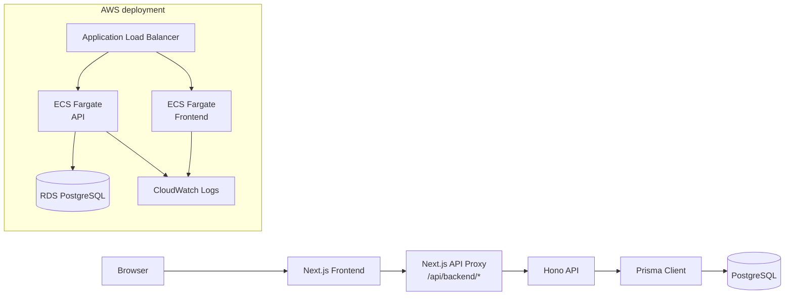

# Modern Accounting App

複式簿記の仕訳入力、勘定科目管理、元帳表示、財務諸表サマリを一気通貫で扱う会計 Web アプリケーションです。

業務ドメインのルールをデータモデル、API、UI、クラウド構成に落とし込むことを目的に、フロントエンドから AWS デプロイ基盤まで実装しました。

> 個人情報・実在顧客データ・本番秘密情報は含めていません。`.env.example` にはダミー値のみを記載しています。

## 作成物の説明

### 何を作ったか

小規模事業者や学習用途を想定した、複式簿記ベースの会計管理アプリです。

- 勘定科目の登録・一覧表示
- 借方/貸方の仕訳登録
- 貸借一致チェック
- 仕訳履歴の表示・削除
- 勘定科目別の元帳表示と差引残高計算
- B/S、P/L の財務諸表サマリ表示
- OpenAPI による API 仕様管理
- Docker によるコンテナ化
- Terraform による AWS ECS Fargate / ALB / RDS / ECR 構成

### 目的・背景

会計アプリは、単なる CRUD ではなく「貸借が一致しなければ登録できない」「勘定科目の区分によって残高の符号が変わる」「仕訳明細を集計して財務諸表を作る」といった業務ルールが中心になります。

このリポジトリでは、その業務制約を TypeScript のアプリケーション層、Prisma のデータモデル、UI の入力体験、クラウド運用設計まで一貫して表現することを重視しました。

## 担当した役割

個人開発として、以下の工程を横断して担当しました。

- 要件整理: 複式簿記に必要な勘定科目、仕訳、仕訳明細、財務諸表サマリのスコープ定義
- DB 設計: Prisma schema による Account / JournalEntry / JournalEntryLine のリレーション設計
- API 実装: Hono による REST API、入力バリデーション、トランザクション処理、集計処理
- フロントエンド実装: Next.js / React による入力フォーム、仕訳一覧、元帳、財務諸表ダッシュボード
- セキュリティ設計: Basic 認証、認証情報のサーバー側プロキシ付与、CORS 制御
- インフラ設計: Docker multi-stage build、ECS Fargate、ALB、RDS、ECR、CloudWatch Logs の Terraform 化
- ドキュメント整備: README、OpenAPI、アーキテクチャ資料、課題解決メモ、CI ワークフロー例

## 技術的な見どころ

### 1. 会計ドメインを反映したデータモデル

`Account`、`JournalEntry`、`JournalEntryLine` を分離し、1 つの仕訳伝票に複数明細を紐づける構造にしました。

勘定科目には `ASSET` / `LIABILITY` / `EQUITY` / `REVENUE` / `EXPENSE` の区分を持たせ、元帳残高や財務諸表集計の基準として利用しています。

### 2. 複式簿記の整合性を API 層で担保

仕訳登録時に、以下を API 側で検証しています。

- 明細が 2 行以上あること
- 借方と貸方が少なくとも 1 行ずつ存在すること
- 金額が正の数値であること
- 借方合計と貸方合計が一致すること

登録処理は Prisma の `$transaction` で実行し、仕訳ヘッダと明細の不整合を防いでいます。

### 3. フロントエンドと API の責務分離

ブラウザは Next.js の `/api/backend/*` にアクセスし、Next.js サーバー側が Hono API へプロキシします。

これにより、API 側の Basic 認証情報をブラウザへ露出せず、フロントエンドとバックエンドを分離したまま安全に接続できます。

### 4. AWS 運用を想定した構成

Terraform で API / Frontend の ECR、ECS Fargate service、ALB、RDS PostgreSQL、CloudWatch Logs、任意の Route 53 + ACM HTTPS を定義しています。

ローカルで動くだけでなく、クラウドに載せる際のネットワーク、ヘルスチェック、ログ、イメージ配布まで考慮しました。

## 使用技術

| 領域 | 技術 |
| --- | --- |
| Frontend | Next.js 16, React 19, TypeScript, Tailwind CSS |
| Backend | Hono, TypeScript, Node.js |
| ORM / DB | Prisma, PostgreSQL |
| API 仕様 | OpenAPI 3.0 |
| Auth / Security | Basic Auth, timing-safe comparison, CORS, server-side API proxy |
| Infrastructure | Docker, Docker Compose, Terraform, AWS ECS Fargate, ALB, RDS, ECR, CloudWatch Logs, Route 53, ACM |
| Testing | node:test, tsx |
| CI | GitHub Actions workflow example |
| AI/LLM モデル | 未使用。会計データモデルと業務ルールを TypeScript / Prisma で実装 |

## アーキテクチャ



詳細は [docs/architecture.md](docs/architecture.md) にまとめています。

## API 概要

| Method | Path | 内容 |
| --- | --- | --- |
| GET | `/health` | API ヘルスチェック |
| GET | `/accounts` | 勘定科目一覧 |
| POST | `/accounts` | 勘定科目登録 |
| GET | `/journal-entries` | 仕訳一覧。`accountId`, `dateFrom`, `dateTo` で絞り込み可能 |
| POST | `/journal-entries` | 仕訳登録 |
| DELETE | `/journal-entries/:id` | 仕訳削除 |
| GET | `/ledger/:accountId` | 勘定科目別元帳 |
| GET | `/reports/financial-statements` | B/S、P/L サマリ |
| GET | `/reports/all-lines` | 全仕訳明細 |

API 仕様は [docs/openapi.yaml](docs/openapi.yaml) に記載しています。

## 直面した課題と解決方法

| 課題 | 解決方法 |
| --- | --- |
| 複式簿記では貸借不一致のデータを保存できない | API 登録時に借方/貸方の存在、正の金額、貸借合計一致を検証 |
| 仕訳ヘッダだけ保存され、明細保存に失敗するとデータが壊れる | Prisma `$transaction` でヘッダと明細を一括登録 |
| 勘定科目区分ごとに残高の増減方向が異なる | 資産・費用は借方増加、負債・純資産・収益は貸方増加として符号計算 |
| ブラウザに API 認証情報を置きたくない | Next.js サーバー側プロキシで Authorization header を付与 |
| クラウド構成が手作業だと再現しにくい | Terraform で ALB / ECS / RDS / ECR / Logs をコード化 |

詳しい内容は [docs/challenges-and-solutions.md](docs/challenges-and-solutions.md) にまとめています。

## ディレクトリ構成

```text
.
├── src/                    # Hono API
│   ├── routes/             # accounts, journal entries, reports
│   ├── middleware/         # Basic auth
│   └── lib/                # Prisma client
├── frontend/               # Next.js frontend
│   └── src/app/
├── prisma/                 # Prisma schema, migrations, seed
├── docs/                   # OpenAPI, technical documents, CI workflow example
├── terraform/              # AWS infrastructure as code
├── Dockerfile              # API container
└── docker-compose.yml      # Local PostgreSQL
```

## ローカル起動

### 1. Database

```bash
docker compose up -d
```

### 2. Backend API

```bash
cp .env.example .env
npm install
npm run prisma:generate
npm run db:migrate
npm run db:seed
npm run dev
```

API は `http://localhost:3001` で起動します。

### 3. Frontend

```bash
cd frontend
cp .env.example .env.local
npm install
npm run dev
```

Frontend は `http://localhost:3000` で起動します。

画面から `/api/backend/*` 経由で API にアクセスします。

## ビルド確認

```bash
npm run build
npm test

cd frontend
npm run lint
npm run build
```

[docs/github-actions-ci.example.yml](docs/github-actions-ci.example.yml) に、backend / frontend のインストール、生成、テスト、ビルド、lint を確認する GitHub Actions workflow 例を置いています。

## AWS デプロイ構成

Terraform は以下を作成します。

- API / Frontend 用 ECR repository
- Application Load Balancer
- ECS Fargate cluster / service / task definition
- RDS PostgreSQL
- CloudWatch Logs
- ECS task から RDS へ接続する Security Group rule
- Optional Route 53 + ACM certificate + HTTPS listener

初回は ECR repository を先に作成し、API / Frontend の Docker image を push してから ECS service を作成します。

```bash
cd terraform
terraform init
terraform apply \
  -target=aws_ecr_repository.api \
  -target=aws_ecr_repository.frontend
```

ECR にログインして image を push した後、全体を apply します。

```bash
AWS_ACCOUNT_ID="$(aws sts get-caller-identity --query Account --output text)"
AWS_REGION="ap-northeast-1"

aws ecr get-login-password --region "$AWS_REGION" \
  | docker login --username AWS --password-stdin "$AWS_ACCOUNT_ID.dkr.ecr.$AWS_REGION.amazonaws.com"

docker build -t modern-accounting-api .
API_ECR_URL="$(terraform output -raw api_ecr_repository_url)"
docker tag modern-accounting-api:latest "${API_ECR_URL}:latest"
docker push "${API_ECR_URL}:latest"

docker build -t modern-accounting-frontend ./frontend
FRONTEND_ECR_URL="$(terraform output -raw frontend_ecr_repository_url)"
docker tag modern-accounting-frontend:latest "${FRONTEND_ECR_URL}:latest"
docker push "${FRONTEND_ECR_URL}:latest"

terraform apply \
  -var='basic_auth_user=admin' \
  -var='basic_auth_password=change_me_strong_password' \
  -var='db_password=change_me_rds_password'
```

公開 URL は apply 後に確認できます。

```bash
terraform output alb_url
```

独自ドメインと HTTPS を有効にする場合は、Route 53 hosted zone を指定します。

```bash
terraform apply \
  -var='basic_auth_user=admin' \
  -var='basic_auth_password=change_me_strong_password' \
  -var='db_password=change_me_rds_password' \
  -var='custom_domain_name=app.example.com' \
  -var='route53_zone_name=example.com'
```

## 今後の改善余地

- 財務諸表集計や API integration test までテスト範囲を広げる
- Zod などで API payload schema を共通化し、OpenAPI と実装の差分を減らす
- 勘定科目の削除・編集、仕訳の編集、CSV export を追加する
- ECS の migration をコンテナ起動時ではなく one-off task に分離する
- AWS Secrets Manager / SSM Parameter Store を使い、ECS 環境変数の秘匿性を高める
