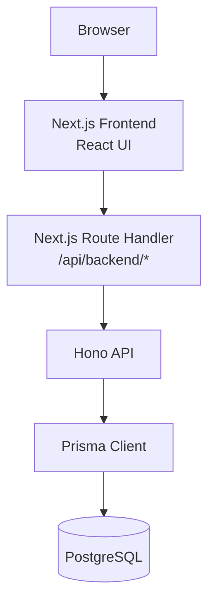
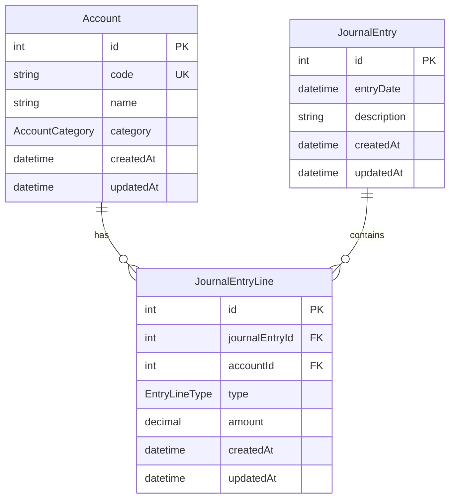
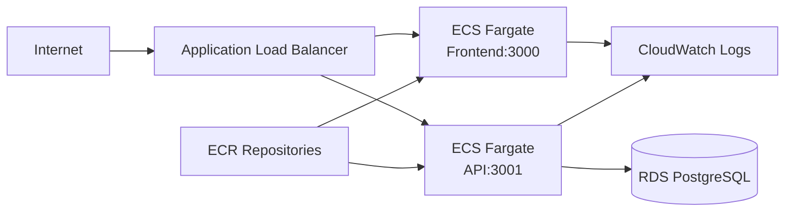

# アーキテクチャ設計

Modern Accounting App の技術構成と主要な設計判断をまとめます。

## システム概要

フロントエンドとバックエンドを分離しつつ、ブラウザからは同一オリジンの `/api/backend/*` にアクセスする構成にしています。Next.js のサーバー側 Route Handler が API へのリクエストを代理し、必要な Basic 認証ヘッダーを付与します。

## 実行時コンポーネント

| Component | Role |
| --- | --- |
| Next.js Frontend | 仕訳入力、元帳、財務諸表サマリ、勘定科目管理を表示 |
| Next.js API Proxy | ブラウザからの API 呼び出しを Hono API へ中継 |
| Hono API | 会計ドメインの入力検証、トランザクション、集計処理 |
| Prisma Client | TypeScript から PostgreSQL へ型安全にアクセス |
| PostgreSQL | 勘定科目、仕訳伝票、仕訳明細を永続化 |
| Terraform / AWS | ECS Fargate、ALB、RDS、ECR、CloudWatch Logs を構築 |

## データモデル

`JournalEntry` は伝票ヘッダ、`JournalEntryLine` は明細です。明細は `DEBIT` または `CREDIT` を持ち、勘定科目の `category` と合わせて元帳残高や財務諸表の集計に利用します。

## リクエストフロー

1. ユーザーが Next.js の画面から仕訳を入力する
2. ブラウザは `/api/backend/journal-entries` に POST する
3. Next.js Route Handler が `API_BASE_URL` の Hono API へリクエストを中継する
4. Hono API が payload を検証する
5. 貸借一致などの会計ルールを満たす場合のみ Prisma transaction で保存する
6. フロントエンドが仕訳一覧と財務諸表サマリを再取得する

## デプロイ構成

ALB は通常の画面アクセスを Frontend target group へ転送し、`/accounts`、`/journal-entries`、`/reports/*`、`/ledger/*`、`/health` を API target group へ転送します。任意で Route 53 と ACM を利用して HTTPS 化できます。

## セキュリティ設計

- Frontend と API の両方で Basic 認証を設定可能
- API 側の Basic 認証比較には `timingSafeEqual` を利用
- Next.js proxy が API 認証ヘッダーをサーバー側で付与し、ブラウザに API 認証情報を出さない
- CORS は許可 origin を環境変数 `CORS_ORIGINS` から制御
- `.env.example` はダミー値のみ。本番値は repository に含めない

## 運用設計

- API container は起動時に `prisma migrate deploy` を実行します
- 小規模検証では簡潔ですが、本番運用では migration を ECS one-off task などに分離するのが望ましいです
- CloudWatch Logs に API / Frontend のログを分けて出力します
- ALB health check は API が `/health`、Frontend が `/frontend-health` を利用します
